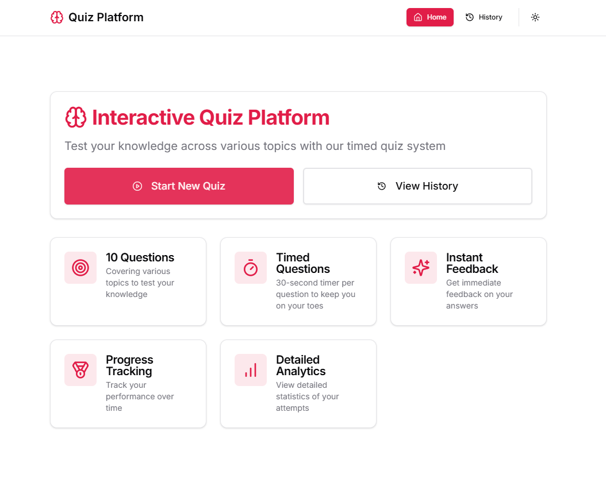

# Interactive Quiz Platform

A modern quiz application built with Next.js 14, featuring timed questions, multiple choice and numerical answers, and detailed performance tracking.

## State Management using Zustand
- Quiz progress and answers
- Timer state
- Quiz history
- Theme preferences

## Data Persistence using IndexedDB
- Quiz attempt history
- Performance metrics
- User preferences

## Features

### Quiz Experience
- ⏱️ 30-second timer for each question
- 🎯 Multiple choice and numerical answer questions
- ✨ Instant feedback on answers
- 🔄 Progress tracking during quiz
- 🎨 Beautiful animations and transitions

### History & Analytics
- 📊 Detailed attempt history
- 📈 Score tracking and performance metrics
- 🕒 Time taken per quiz
- 🔍 Question-by-question review
- 📱 Responsive history cards

### User Interface
- 🌓 Dark/Light theme support
- 📱 Fully responsive design
- 🎨 Modern, clean UI with shadcn/ui
- ✨ Smooth animations with Framer Motion
- 🎯 Intuitive navigation

## Tech Stack

- **Framework**: Next.js 14 (App Router)
- **Styling**: Tailwind CSS + shadcn/ui
- **State Management**: Zustand
- **Database**: IndexedDB (idb)
- **Animations**: Framer Motion
- **Icons**: Lucide Icons
- **Toast Notifications**: Sonner

